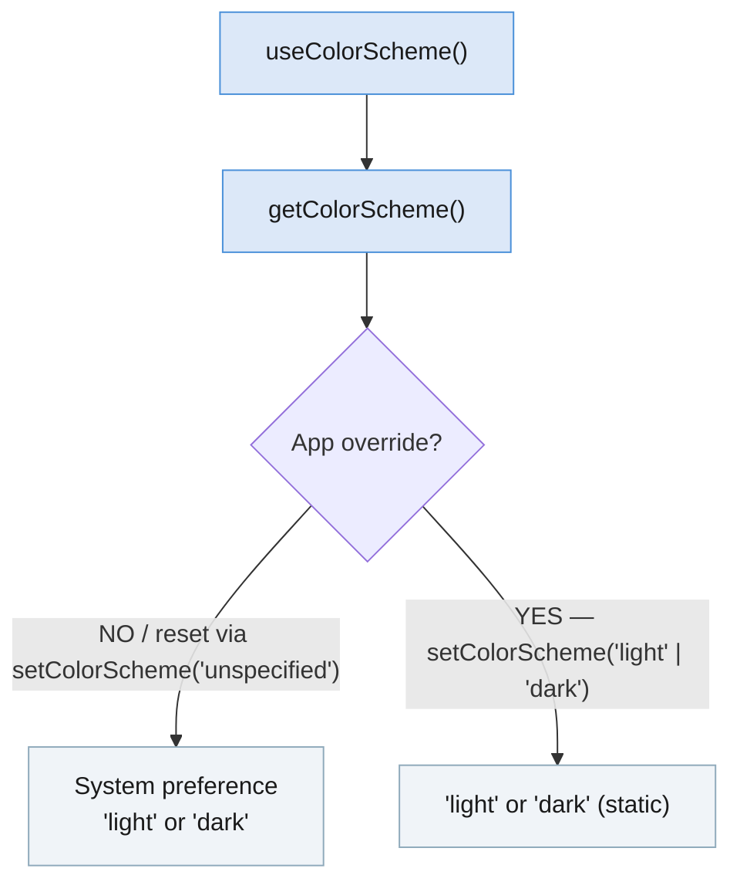

import Tabs from '@theme/Tabs'; import TabItem from '@theme/TabItem'; import constants from '@site/core/TabsConstants';

```tsx
import {Appearance} from 'react-native';
```

`Appearance` 模块提供有关用户外观偏好的信息，例如他们偏好的系统配色方案（浅色或深色）。

#### 开发者说明

<Tabs groupId="guide" queryString defaultValue="web" values={constants.getDevNotesTabs(["android", "ios", "web"])}>

<TabItem value="web">

:::info
`Appearance` API 的灵感来自 W3C 的 [Media Queries 草案](https://drafts.csswg.org/mediaqueries-5/)。配色方案偏好是仿照 [`prefers-color-scheme` CSS 媒体特性](https://developer.mozilla.org/en-US/docs/Web/CSS/@media/prefers-color-scheme) 建模的。
:::

</TabItem>
<TabItem value="android">

:::info
在 Android 10（API 级别 29）及更高版本的设备上，配色方案偏好将映射到用户的浅色或 [深色主题](https://developer.android.com/guide/topics/ui/look-and-feel/darktheme) 偏好。
:::

</TabItem>
<TabItem value="ios">

:::info
在 iOS 13 及更高版本的设备上，配色方案偏好将映射到用户的浅色或 [深色模式](https://developer.apple.com/design/human-interface-guidelines/ios/visual-design/dark-mode/) 偏好。
:::

:::note
截取屏幕截图时，默认情况下，配色方案可能会在浅色和深色模式之间闪烁。这是因为 iOS 会对两种配色方案都进行快照，而使用配色方案更新用户界面是异步的。
:::

</TabItem>
</Tabs>

## 示例

你可以使用 `Appearance` 模块来确定用户是否偏好深色配色方案：

```tsx
const colorScheme = Appearance.getColorScheme();
if (colorScheme === 'dark') {
  // 使用深色配色方案
}
```

虽然配色方案会立即可用，但当未通过 `setColorScheme()` 覆盖时，它可能会发生变化（例如在日出或日落时按计划切换配色方案）。任何依赖用户偏好配色方案的渲染逻辑或样式都应尝试在每次渲染时调用此函数，而不是缓存该值。

**推荐：** 使用 [`useColorScheme`](usecolorscheme) hook。

### 应用级覆盖

`setColorScheme()` 会在应用级别覆盖配色方案——它不会影响系统设置或其他应用程序。传入 `'unspecified'` 会移除任何覆盖，恢复系统偏好。



---

# 参考

## 方法

### `getColorScheme()`

```tsx
static getColorScheme(): 'light' | 'dark' | 'unspecified' | null;
```

返回当前活动的配色方案。该值可能会在稍后更新，既可能通过直接用户操作（例如设备设置中的主题选择，或通过 `setColorScheme` 在应用级别选择的用户界面样式）进行更新，也可能按计划（例如遵循昼夜周期的浅色和深色主题）进行更新。

返回值：

- `'light'`：应用浅色配色方案。
- `'dark'`：应用深色配色方案。
- `'unspecified'`：**_永远不会返回_**（类型标注错误）。
- `null`：当原生 Appearance 模块不可用时可能返回。

另请参见：[`useColorScheme`](usecolorscheme)（hook）。

---

### `setColorScheme()`

```tsx
static setColorScheme('light' | 'dark' | 'unspecified'): void;
```

强制应用始终采用浅色或深色界面样式。该更改会应用于应用及其中所有原生元素（Alerts、Pickers 等）。

这是应用级覆盖——它不会影响系统选择的界面样式，也不会影响其他应用中设置的任何样式。

支持的值：

- `'light'`：应用浅色配色方案。
- `'dark'`：应用深色配色方案。
- `'unspecified'`：遵循系统配色方案（移除任何覆盖）。

---

### `addChangeListener()`

```tsx
static addChangeListener(
  listener: (preferences: {colorScheme: 'light' | 'dark' | null}) => void,
): NativeEventSubscription;
```

添加一个事件处理程序，当外观偏好发生变化时会触发。在 iOS 和 Android 上，回调中的 `colorScheme` 值始终为 `'light'` 或 `'dark'`。
