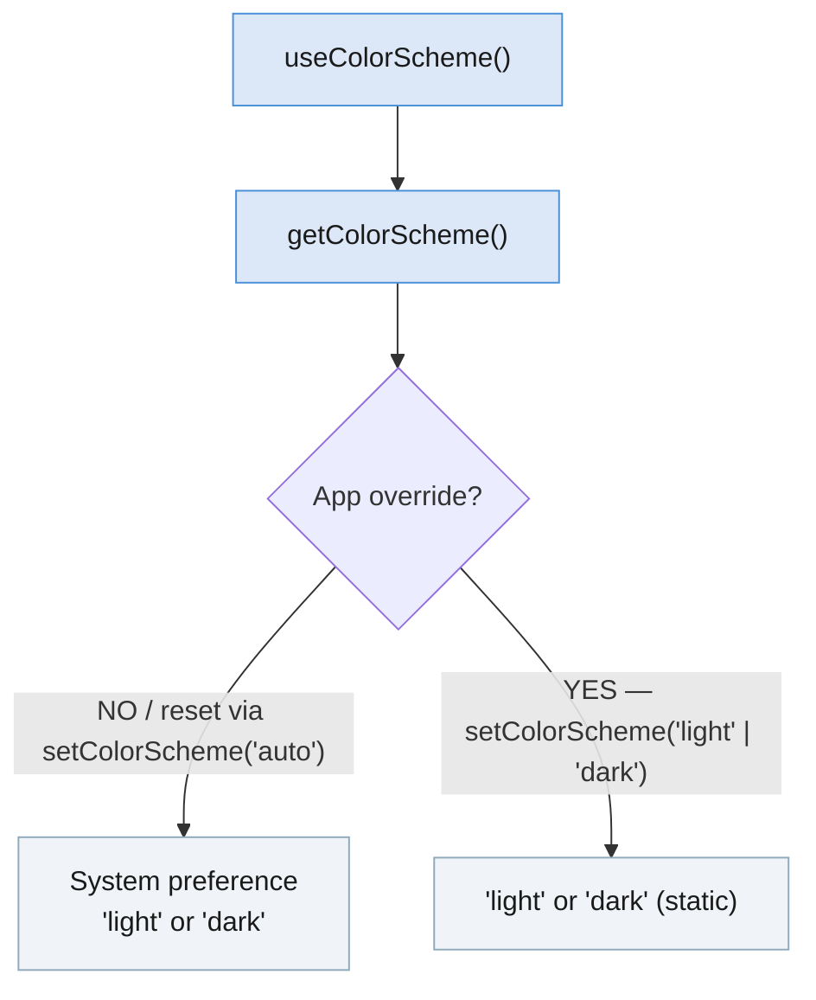

import Tabs from '@theme/Tabs'; import TabItem from '@theme/TabItem'; import constants from '@site/core/TabsConstants';

```tsx
import {Appearance} from 'react-native';
```

`Appearance` 模块公开用户外观偏好的信息，例如用户偏好的系统配色方案（浅色或深色）。

#### 开发者说明

<Tabs groupId="guide" queryString defaultValue="web" values={constants.getDevNotesTabs(["android", "ios", "web"])}>

<TabItem value="web">

:::info
`Appearance` API 的设计灵感来源于 W3C 的 [Media Queries 草案](https://drafts.csswg.org/mediaqueries-5/)。配色方案偏好基于 [`prefers-color-scheme` CSS 媒体特性](https://developer.mozilla.org/en-US/docs/Web/CSS/@media/prefers-color-scheme)。
:::

</TabItem>
<TabItem value="android">

:::info
在 Android 10（API level 29）及更高版本的设备上，配色方案偏好将映射到用户的浅色或[深色主题](https://developer.android.com/guide/topics/ui/look-and-feel/darktheme)偏好。
:::

</TabItem>
<TabItem value="ios">

:::info
在 iOS 13 及更高版本的设备上，配色方案偏好将映射到用户的浅色或[深色模式](https://developer.apple.com/design/human-interface-guidelines/ios/visual-design/dark-mode/)偏好。
:::

:::note
截取屏幕截图时，默认情况下，配色方案可能会在浅色和深色模式之间闪烁。这是因为 iOS 会在两种配色方案下截取快照，而使用配色方案更新用户界面是异步的。
:::

</TabItem>
</Tabs>

## 示例

你可以使用 `Appearance` 模块来确定用户是否偏好深色配色方案：

```tsx
const colorScheme = Appearance.getColorScheme();
if (colorScheme === 'dark') {
  // Use dark color scheme
}
```

尽管配色方案可以立即获取，但在未通过 `setColorScheme()` 覆盖时，它可能会发生变化（例如日出或日落时计划的配色方案变更）。任何依赖于用户偏好配色方案的渲染逻辑或样式，都应尝试在每次渲染时调用此函数，而不是缓存该值。

**推荐：** 使用 [`useColorScheme`](usecolorscheme) hook。

### 应用级覆盖

`setColorScheme()` 会在应用级别覆盖配色方案——不会影响系统设置或其他应用。传入 `'auto'` 会移除任何覆盖，恢复系统偏好。



---

# 参考

## 方法

### `getColorScheme()`

```tsx
static getColorScheme(): 'light' | 'dark' | null;
```

返回当前使用的配色方案。此值可能会在运行时发生变化，变化可能发生在系统级别（例如日出或日落时计划的配色方案变更），也可能发生在通过 `setColorScheme()` 进行应用级别覆盖时。

返回值：

- `'light'`：应用浅色配色方案
- `'dark'`：应用深色配色方案
- `null`：如果原生 Appearance 模块不可用，则可能返回此值

另请参阅：[`useColorScheme`](usecolorscheme)（hook）。

---

### `setColorScheme()`

```tsx
static setColorScheme('light' | 'dark' | 'auto' | 'unspecified'): void;
```

强制应用始终采用浅色或深色界面样式。此变更会应用于应用及其中的所有原生元素（Alerts、Pickers 等）。

这是应用级别的覆盖——不会影响系统选定的界面样式，也不会影响其他应用中设置的任何样式。

支持的值：

- `'light'`：应用浅色配色方案
- `'dark'`：应用深色配色方案
- `'auto'`：遵循系统配色方案（移除任何覆盖）
- `'unspecified'`（**已弃用**）：遵循系统配色方案（移除任何覆盖）

---

### `addChangeListener()`

```tsx
static addChangeListener(
  listener: (preferences: {colorScheme: 'light' | 'dark' | null}) => void,
): NativeEventSubscription;
```

添加一个外观偏好发生变化时触发的事件处理程序。在 iOS 和 Android 上，回调中的 `colorScheme` 值始终为 `'light'` 或 `'dark'`。
